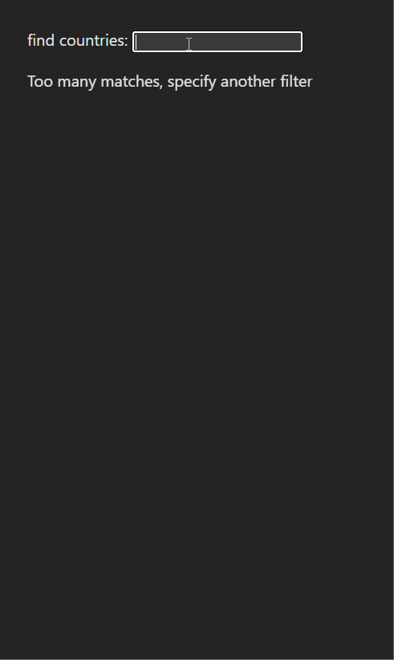

# Country Search App 🌍

A simple React training project that allows users to search for countries and view detailed information about them.  
It fetches real-time country data from the **REST Countries API**.

---

## Features
- 🔎 Search countries by name (case-insensitive).
- 📋 List of countries when there are 2–10 matches.
- ⚠️ Warning message when there are more than 10 matches.
- 📖 Detailed information (capital, area, languages, and flag) when only one country matches.

---

## Tech Stack
- **React** (useState, useEffect)
- **Axios** (for fetching data)
- **REST Countries API** → [https://studies.cs.helsinki.fi/restcountries/api/all](https://studies.cs.helsinki.fi/restcountries/api/all)

---

## How It Works
1. User types in the search input.  
2. Countries are filtered by name from the API data.  
3. Display logic:
   - More than 10 matches → show a message:  
     *“Too many matches, specify another filter.”*
   - Exactly 1 match → show **country details**:
     - Name
     - Capital
     - Area
     - Languages
     - Flag
   - 2–10 matches → show a simple list of country names.

## In Action
Here’s how the app works in action 👇



---

## Installation & Setup
1. Clone the repo:
   ```bash
   git clone https://github.com/your-username/country-search-app.git
2. Navigate into the project:
   ```bash
   cd country-search-app
3. Install dependencies:
   ```bash
   npm install
4. Run the development server:
   ```bash
   npm start

