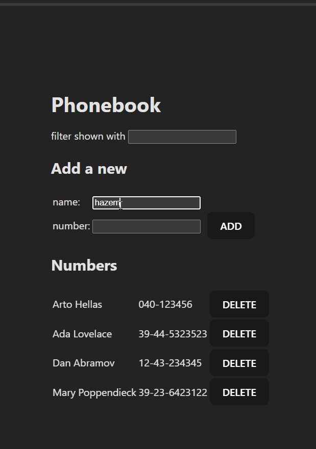

# 📞 Phonebook App

A simple React-based phonebook application that allows you to **add,
update, search, and delete contacts**.\
It uses a JSON server as the backend to persist data (`db.json`).

------------------------------------------------------------------------

## 🎥 Demo

Here's a quick preview of the app in action:



*(Replace `./demo.gif` with the correct path to your GIF inside your
project. For GitHub, keep the GIF in the root folder or `/assets/`.)*

------------------------------------------------------------------------

## 🚀 Features

-   🔍 **Search Contacts** -- Filter contacts by name in real-time.\
-   ➕ **Add Contacts** -- Add a new person with a name and number.\
-   🔄 **Update Numbers** -- Update a person's number if the name
    already exists.\
-   ❌ **Delete Contacts** -- Remove a person from the phonebook.\
-   ✅ **Form Validation** -- Prevents adding empty fields or duplicate
    numbers.\
-   📢 **User Notifications** -- Success, error, and warning messages
    with auto-dismiss.

------------------------------------------------------------------------

## 🛠️ Tech Stack

-   **Frontend**: React (Hooks: `useState`, `useEffect`)\
-   **Backend**: JSON Server (Fake REST API)\
-   **Styling**: CSS (`index.css`)

------------------------------------------------------------------------

## 📂 Project Structure

    phonebook-app/
    │── db.json              # Mock backend data (JSON Server)
    │── src/
    │   ├── App.jsx          # Main React component
    │   ├── services/
    │   │   └── persons.js   # Axios service for API calls
    │   ├── index.css        # Styles
    │   └── ...
    │── demo.gif             # Demo preview (for README)
    │── package.json
    └── README.md

------------------------------------------------------------------------

## ⚡ How It Works

### Components

-   **`Filter`**\
    Input field to filter contacts by name.

-   **`PersonForm`**\
    Controlled form to add or update a contact.

-   **`Persons`**\
    Displays the list of persons with delete buttons.

-   **`Message`**\
    Notification system for success, error, and warnings.

-   **`App` (Main Component)**\
    Handles state management, CRUD operations, form submission, search,
    and notifications.

### Services (`services/persons.js`)

A helper module (not shown here, but assumed) that interacts with the
JSON server API using Axios.\
Typical functions include: - `getAll()` -- fetch all persons\
- `create(person)` -- add a new person\
- `update(id, person)` -- update an existing person\
- `deletion(id)` -- delete a person

------------------------------------------------------------------------

## ▶️ Getting Started

1.  **Clone the repo**

    ``` bash
    git clone https://github.com/yourusername/phonebook-app.git
    cd phonebook-app
    ```

2.  **Install dependencies**

    ``` bash
    npm install
    ```

3.  **Run JSON Server**

    ``` bash
    npx json-server --watch db.json --port 3001
    ```

4.  **Start React App**

    ``` bash
    npm run dev
    ```

5.  Open in browser:\
    👉 <http://localhost:5173> (if using Vite)

------------------------------------------------------------------------

## 🧪 Example Usage

-   Add: Enter name + number → click **ADD**\
-   Update: Try adding the same name with a different number →
    confirmation dialog\
-   Delete: Click **DELETE** button → confirmation prompt\
-   Search: Type in the filter field → see results update instantly

------------------------------------------------------------------------

## 📜 License

This project is licensed under the MIT License.

------------------------------------------------------------------------

💡 *This project is a practice app for learning React and working with
JSON Server.*
